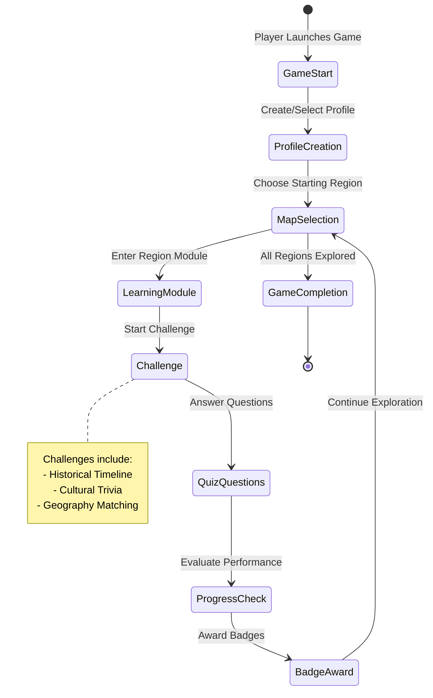
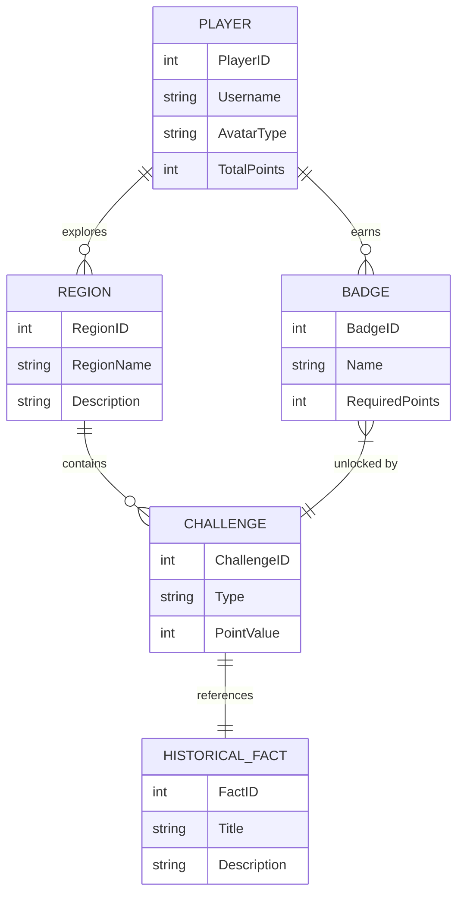
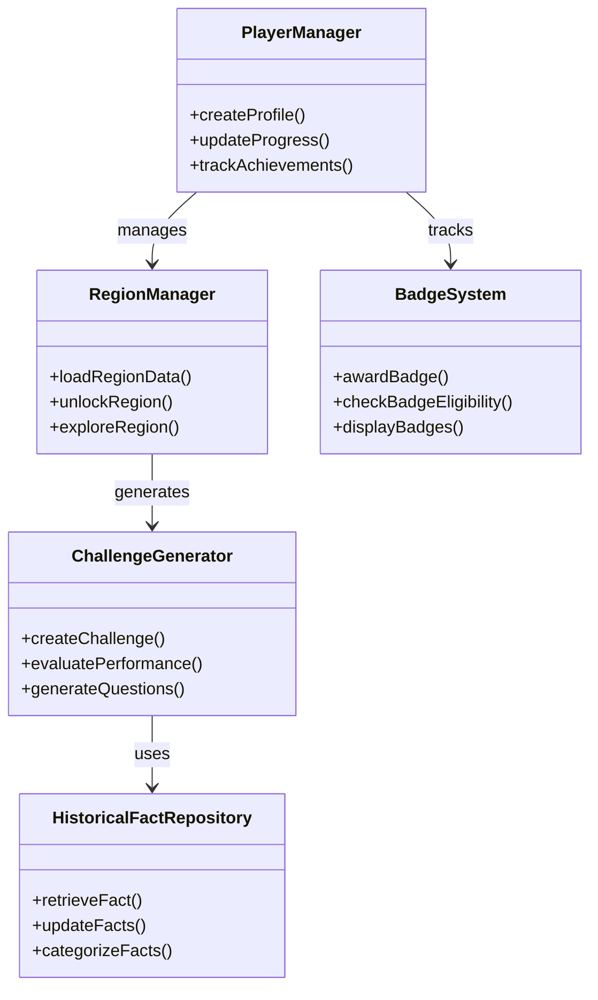

# Bolivia Discovery Game: Educational Use Case

This comprehensive set of artifacts provides a detailed blueprint for an educational game about Bolivia. The game is designed to engage students aged 12-16 in an interactive learning experience that covers the country's history, geography, and culture.
The artifacts include:

* A use case describing the game's educational objectives
* Detailed gameplay steps
* Entities and properties for game data
* Flow and activity diagrams
* Description of entity and class diagrams
* Mermaid JS code for entity and class diagrams
* HTML structure for game web pages

## Game Overview
An interactive, educational web-based game that helps students aged 12-16 learn about Bolivia's history, geography, culture, and significant landmarks through engaging gameplay.

## Primary Use Case: Student Learning Journey

### Actors
- Student Player
- Game System

### Main Objectives
1. Enable students to explore Bolivia's diverse regions
2. Learn historical facts and cultural information
3. Test knowledge through interactive challenges
4. Provide an immersive and engaging learning experience

### Key Use Cases
- Navigate through different regions of Bolivia
- Answer historical and cultural quiz questions
- Collect virtual "knowledge badges"
- Track learning progress
- View detailed information about Bolivian landmarks, cultures, and historical events

### Learning Outcomes
- Develop geographical understanding of Bolivia
- Gain insights into Bolivian history and cultural diversity
- Improve critical thinking and knowledge retention through interactive gameplay


# Bolivia Discovery Game: Gameplay Steps

## 1. Game Initialization
- Player creates a profile
- Select difficulty level (Junior Explorer, Advanced Explorer, Master Explorer)
- Choose an avatar representing a Bolivian cultural group

## 2. Game Map Navigation
- Interactive map of Bolivia with clickable regions
- Each region reveals unique challenges and learning modules
- Regions include: La Paz, Santa Cruz, Cochabamba, Potosí, Oruro

## 3. Learning Modules
- Text-based historical information
- Multimedia content (images, short videos)
- Interactive quizzes about each region
- Cultural fact discoveries

## 4. Challenge Modes
- Historical Timeline Challenge
- Cultural Trivia Quiz
- Geography Matching Game
- Flag and Landmark Identification

## 5. Progress Tracking
- Knowledge points accumulation
- Badge collection for completed challenges
- Leaderboard for competitive learning
- Personal progress dashboard

## 6. Bonus Features
- Virtual museum exploration
- Language learning mini-games
- Historical figure biography challenges

# Bolivia Discovery Game: Entities and Properties

## 1. Player
- PlayerID (unique identifier)
- Username
- AvatarType
- DifficultyLevel
- TotalKnowledgePoints
- CompletedRegions
- UnlockedBadges

## 2. Region
- RegionID
- RegionName
- GeographicalDescription
- HistoricalSignificance
- CulturalHighlights
- Challenges
- UnlockRequirements

## 3. Challenge
- ChallengeID
- RegionID
- ChallengeType
- DifficultyLevel
- QuestionSet
- PointValue
- TimeLimit

## 4. Badge
- BadgeID
- BadgeName
- Description
- RequiredPoints
- IconImage

## 5. Historical Fact
- FactID
- Title
- Description
- RelatedRegion
- HistoricalPeriod
- SourceReference

## 6. Multimedia
- MediaID
- Type (image/video/audio)
- Title
- FilePath
- RelatedRegion
- Description

# Bolivia Discovery Game: Game Flow and Activity Diagrams



# Bolivia Discovery Game: Entity Diagram

# Bolivia Discovery Game: Game Entity Relationship Diagram




# Bolivia Discovery Game: Game Class Diagram




# Bolivia Discovery Game: HTML

I'll create a more detailed HTML structure with enhanced features and interactivity for the Bolivia Discovery Game.

Let me elaborate on the key features of this enhanced HTML structure:

1. Navigation Component
- Includes a logo
- Navigation menu with key sections
- User status display showing username and points
- Responsive design considerations

2. Landing Page
- Introductory video about Bolivia
- Options to start a new game or continue a saved game
- Engaging headline and description

3. Profile Creation Page
- Detailed form for creating player profile
- Cultural avatar selection with images
- Difficulty level selection
- Age-appropriate difficulty options

4. Bolivia Interactive Map Page
- SVG map with clickable regions
- Region details section
- Challenge list for selected region

5. Challenge Page
- Timer for challenge
- Current score tracking
- Question container
- Answer submission and navigation buttons

6. Progress Dashboard
- Badge collection display
- Learning statistics chart
- Region progress tracking
- Achievements section

7. Footer
- Copyright information
- Additional links (credits, privacy policy, support)

Additional Recommendations:
- Implement responsive design with CSS
- Use JavaScript for interactivity
- Add error handling and validation
- Create a robust game state management system
- Implement accessibility features

Would you like me to elaborate on any specific section or discuss potential JavaScript interactions for these pages?
# Bolivia Discovery Game: Javascript

I'll create a comprehensive JavaScript file to handle the interactions for the Bolivia Discovery Game.

```javascript
// Bolivia Discovery Game - Main Game Logic

class BoliviaDiscoveryGame {
    constructor() {
        // Game state management
        this.gameState = {
            currentPlayer: null,
            currentRegion: null,
            currentChallenge: null,
            totalPoints: 0,
            unlockedRegions: [],
            earnedBadges: []
        };

        // Initialize event listeners
        this.initializeEventListeners();
    }

    // Initialize all event listeners
    initializeEventListeners() {
        // Navigation events
        this.setupNavigationEvents();

        // Profile creation events
        this.setupProfileCreationEvents();

        // Map interaction events
        this.setupMapInteractionEvents();

        // Challenge events
        this.setupChallengeEvents();
    }

    // Navigation between pages
    setupNavigationEvents() {
        const navLinks = document.querySelectorAll('.nav-link');
        navLinks.forEach(link => {
            link.addEventListener('click', (e) => {
                e.preventDefault();
                const targetPage = e.target.getAttribute('href').substring(1);
                this.navigateToPage(targetPage);
            });
        });
    }

    // Page navigation method
    navigateToPage(pageId) {
        // Hide all pages
        document.querySelectorAll('.page').forEach(page => {
            page.classList.remove('active');
        });

        // Show target page
        const targetPage = document.getElementById(pageId);
        if (targetPage) {
            targetPage.classList.add('active');
        }
    }

    // Profile Creation Logic
    setupProfileCreationEvents() {
        const profileForm = document.getElementById('profile-creation-form');
        profileForm.addEventListener('submit', (e) => {
            e.preventDefault();
            this.createPlayerProfile();
        });
    }

    // Create Player Profile
    createPlayerProfile() {
        const username = document.getElementById('username').value;
        const avatar = document.querySelector('input[name="avatar"]:checked')?.value;
        const difficulty = document.getElementById('difficulty').value;

        // Validate inputs
        if (!username || !avatar) {
            this.showErrorMessage('Please complete all profile details');
            return;
        }

        // Create player profile
        this.gameState.currentPlayer = {
            username,
            avatar,
            difficulty,
            createdAt: new Date()
        };

        // Update UI
        this.updateUserStatus();
        this.navigateToPage('map');
    }

    // Update user status in navigation
    updateUserStatus() {
        const usernameDisplay = document.getElementById('username-display');
        const pointsDisplay = document.getElementById('points-display');

        if (this.gameState.currentPlayer) {
            usernameDisplay.textContent = this.gameState.currentPlayer.username;
            pointsDisplay.textContent = `${this.gameState.totalPoints} Knowledge Points`;
        }
    }

    // Map Interaction Events
    setupMapInteractionEvents() {
        const regions = document.querySelectorAll('.region');
        regions.forEach(region => {
            region.addEventListener('click', (e) => {
                const regionId = e.target.dataset.region;
                this.selectRegion(regionId);
            });
        });
    }

    // Region Selection
    selectRegion(regionId) {
        // Check if region is unlocked
        if (!this.isRegionUnlocked(regionId)) {
            this.showErrorMessage('This region is not yet unlocked!');
            return;
        }

        this.gameState.currentRegion = regionId;
        this.updateRegionDetails(regionId);
        this.loadRegionChallenges(regionId);
    }

    // Check if region is unlocked
    isRegionUnlocked(regionId) {
        return this.gameState.unlockedRegions.includes(regionId) || 
               this.gameState.unlockedRegions.length === 0; // First region always unlocked
    }

    // Update Region Details
    updateRegionDetails(regionId) {
        const regionNameElement = document.getElementById('selected-region-name');
        const regionDescriptionElement = document.getElementById('region-description');

        // Region details (would typically come from a data source)
        const regionDetails = {
            'la-paz': {
                name: 'La Paz',
                description: 'The administrative capital of Bolivia, known for its unique geography and cultural richness.'
            },
            'santa-cruz': {
                name: 'Santa Cruz',
                description: 'The largest city in Bolivia, a hub of economic activity and biodiversity.'
            }
        };

        const details = regionDetails[regionId];
        regionNameElement.textContent = details.name;
        regionDescriptionElement.textContent = details.description;
    }

    // Load Region Challenges
    loadRegionChallenges(regionId) {
        const challengeList = document.getElementById('challenge-list');
        challengeList.innerHTML = ''; // Clear previous challenges

        // Example challenges (would typically come from a data source)
        const challenges = {
            'la-paz': [
                { id: 'history-quiz', name: 'La Paz Historical Quiz' },
                { id: 'geography-challenge', name: 'Geographic Landmarks' }
            ],
            'santa-cruz': [
                { id: 'biodiversity-quiz', name: 'Biodiversity Challenge' },
                { id: 'economic-history', name: 'Economic Development' }
            ]
        };

        const regionChallenges = challenges[regionId];
        regionChallenges.forEach(challenge => {
            const challengeItem = document.createElement('li');
            challengeItem.textContent = challenge.name;
            challengeItem.dataset.challengeId = challenge.id;
            challengeItem.addEventListener('click', () => this.startChallenge(challenge.id));
            challengeList.appendChild(challengeItem);
        });
    }

    // Challenge Setup
    setupChallengeEvents() {
        const submitAnswerBtn = document.getElementById('submit-answer-btn');
        const nextQuestionBtn = document.getElementById('next-question-btn');

        submitAnswerBtn.addEventListener('click', () => this.submitAnswer());
        nextQuestionBtn.addEventListener('click', () => this.loadNextQuestion());
    }

    // Start a Challenge
    startChallenge(challengeId) {
        this.gameState.currentChallenge = challengeId;
        this.navigateToPage('challenge');
        this.loadChallengeQuestions();
    }

    // Load Challenge Questions
    loadChallengeQuestions() {
        // Placeholder for question loading logic
        const questions = {
            'history-quiz': [
                {
                    text: 'When did Bolivia gain independence?',
                    options: ['1825', '1900', '1776', '1810'],
                    correctAnswer: '1825'
                }
                // More questions...
            ]
        };

        const currentChallengeQuestions = questions[this.gameState.currentChallenge];
        this.displayQuestion(currentChallengeQuestions[0]);
    }

    // Display Question
    displayQuestion(question) {
        const questionTextElement = document.getElementById('question-text');
        const answerOptionsElement = document.getElementById('answer-options');

        questionTextElement.textContent = question.text;
        
        // Clear previous options
        answerOptionsElement.innerHTML = '';

        // Create answer options
        question.options.forEach(option => {
            const optionElement = document.createElement('div');
            optionElement.classList.add('answer-option');
            
            const radioInput = document.createElement('input');
            radioInput.type = 'radio';
            radioInput.name = 'challenge-answer';
            radioInput.value = option;
            radioInput.id = `option-${option}`;

            const label = document.createElement('label');
            label.htmlFor = `option-${option}`;
            label.textContent = option;

            optionElement.appendChild(radioInput);
            optionElement.appendChild(label);
            answerOptionsElement.appendChild(optionElement);
        });
    }

    // Submit Answer
    submitAnswer() {
        const selectedAnswer = document.querySelector('input[name="challenge-answer"]:checked');
        
        if (!selectedAnswer) {
            this.showErrorMessage('Please select an answer');
            return;
        }

        // Validate answer (placeholder logic)
        const isCorrect = this.checkAnswer(selectedAnswer.value);
        
        if (isCorrect) {
            this.gameState.totalPoints += 10;
            this.showSuccessMessage('Correct Answer! +10 Points');
        } else {
            this.showErrorMessage('Incorrect Answer');
        }

        this.updateUserStatus();
    }

    // Check Answer
    checkAnswer(selectedAnswer) {
        // Placeholder answer checking logic
        return selectedAnswer === '1825';
    }

    // Load Next Question
    loadNextQuestion() {
        // Placeholder for next question logic
        this.showErrorMessage('More questions coming soon!');
    }

    // Error Message Display
    showErrorMessage(message) {
        const messageContainer = document.createElement('div');
        messageContainer.classList.add('error-message');
        messageContainer.textContent = message;
        document.body.appendChild(messageContainer);

        // Remove message after 3 seconds
        setTimeout(() => {
            document.body.removeChild(messageContainer);
        }, 3000);
    }

    // Success Message Display
    showSuccessMessage(message) {
        const messageContainer = document.createElement('div');
        messageContainer.classList.add('success-message');
        messageContainer.textContent = message;
        document.body.appendChild(messageContainer);

        // Remove message after 3 seconds
        setTimeout(() => {
            document.body.removeChild(messageContainer);
        }, 3000);
    }

    // Initialize Game
    initializeGame() {
        // Initial setup when game loads
        this.navigateToPage('landing');
    }
}

// Initialize the game when the DOM is fully loaded
document.addEventListener('DOMContentLoaded', () => {
    const boliviaGame = new BoliviaDiscoveryGame();
    boliviaGame.initializeGame();
});

```

Let me provide a detailed breakdown of the JavaScript implementation:

1. Game Architecture
- Implemented as a class-based approach
- Centralized game state management
- Modular event handling methods

2. Key Features
- Navigation between pages
- Profile creation with validation
- Interactive map with region selection
- Challenge system with question loading
- Point tracking
- Error and success message handling

3. Navigation Mechanics
- Dynamic page switching
- Active page management
- Event-driven navigation

4. Profile Creation
- Form validation
- Player profile object creation
- Difficulty and avatar selection

5. Region Interaction
- Region unlocking mechanism
- Dynamic region details loading
- Challenge list generation

6. Challenge System
- Question loading
- Answer submission
- Point calculation
- Basic feedback mechanism

7. Error Handling
- Custom error and success message displays
- Input validation
- Graceful error management

Recommended Next Steps:
- Implement more robust data persistence
- Create a more extensive question bank
- Add more complex challenge types
- Implement badge and achievement systems
- Create more detailed region interactions

Would you like me to elaborate on any specific aspect of the game's JavaScript implementation? I can provide more details about game mechanics, expand on certain features, or discuss potential enhancements.