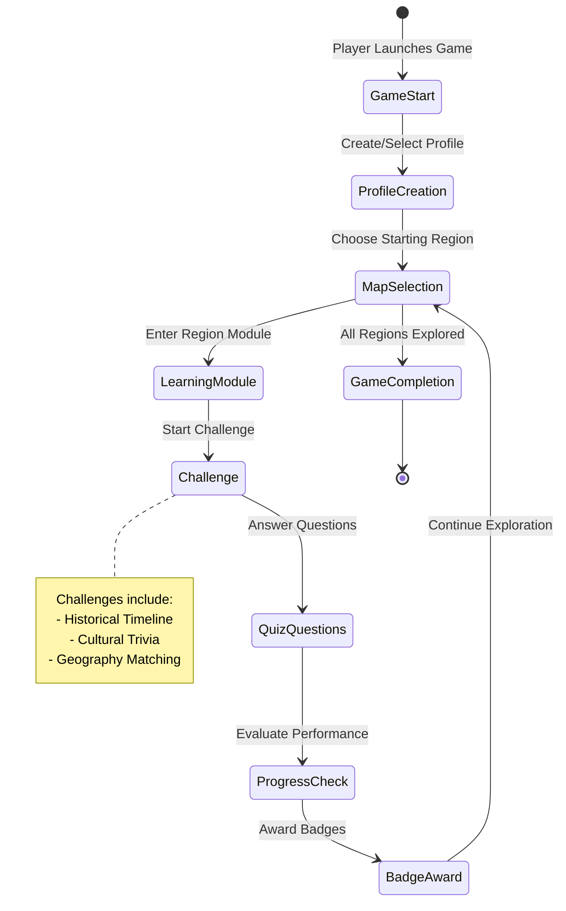
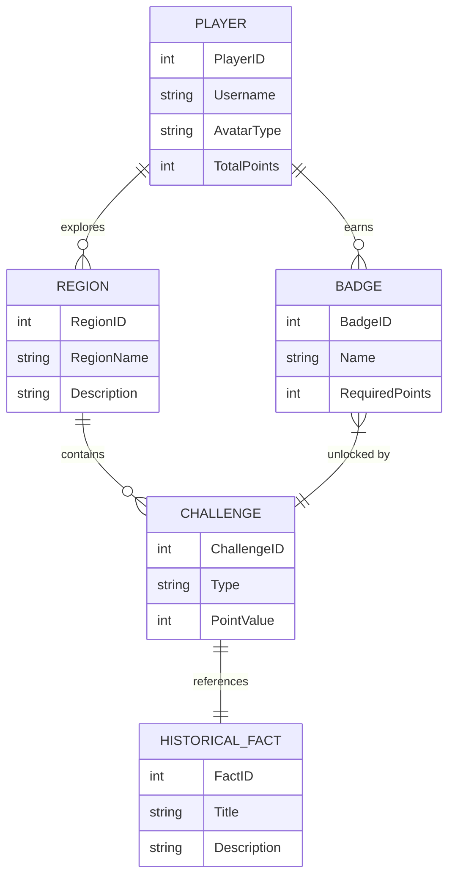

# Bolivia Discovery Game: Educational Use Case

## Game Overview
An interactive, educational web-based game that helps students aged 12-16 learn about Bolivia's history, geography, culture, and significant landmarks through engaging gameplay.

## Primary Use Case: Student Learning Journey

### Actors
- Student Player
- Game System

### Main Objectives
1. Enable students to explore Bolivia's diverse regions
2. Learn historical facts and cultural information
3. Test knowledge through interactive challenges
4. Provide an immersive and engaging learning experience

### Key Use Cases
- Navigate through different regions of Bolivia
- Answer historical and cultural quiz questions
- Collect virtual "knowledge badges"
- Track learning progress
- View detailed information about Bolivian landmarks, cultures, and historical events

### Learning Outcomes
- Develop geographical understanding of Bolivia
- Gain insights into Bolivian history and cultural diversity
- Improve critical thinking and knowledge retention through interactive gameplay


# Bolivia Discovery Game: Gameplay Steps

## 1. Game Initialization
- Player creates a profile
- Select difficulty level (Junior Explorer, Advanced Explorer, Master Explorer)
- Choose an avatar representing a Bolivian cultural group

## 2. Game Map Navigation
- Interactive map of Bolivia with clickable regions
- Each region reveals unique challenges and learning modules
- Regions include: La Paz, Santa Cruz, Cochabamba, Potosí, Oruro

## 3. Learning Modules
- Text-based historical information
- Multimedia content (images, short videos)
- Interactive quizzes about each region
- Cultural fact discoveries

## 4. Challenge Modes
- Historical Timeline Challenge
- Cultural Trivia Quiz
- Geography Matching Game
- Flag and Landmark Identification

## 5. Progress Tracking
- Knowledge points accumulation
- Badge collection for completed challenges
- Leaderboard for competitive learning
- Personal progress dashboard

## 6. Bonus Features
- Virtual museum exploration
- Language learning mini-games
- Historical figure biography challenges

# Bolivia Discovery Game: Entities and Properties

## 1. Player
- PlayerID (unique identifier)
- Username
- AvatarType
- DifficultyLevel
- TotalKnowledgePoints
- CompletedRegions
- UnlockedBadges

## 2. Region
- RegionID
- RegionName
- GeographicalDescription
- HistoricalSignificance
- CulturalHighlights
- Challenges
- UnlockRequirements

## 3. Challenge
- ChallengeID
- RegionID
- ChallengeType
- DifficultyLevel
- QuestionSet
- PointValue
- TimeLimit

## 4. Badge
- BadgeID
- BadgeName
- Description
- RequiredPoints
- IconImage

## 5. Historical Fact
- FactID
- Title
- Description
- RelatedRegion
- HistoricalPeriod
- SourceReference

## 6. Multimedia
- MediaID
- Type (image/video/audio)
- Title
- FilePath
- RelatedRegion
- Description






```
classDiagram
    class PlayerManager {
        +createProfile()
        +updateProgress()
        +trackAchievements()
    }
    
    class RegionManager {
        +loadRegionData()
        +unlockRegion()
        +exploreRegion()
    }
    
    class ChallengeGenerator {
        +createChallenge()
        +evaluatePerformance()
        +generateQuestions()
    }
    
    class BadgeSystem {
        +awardBadge()
        +checkBadgeEligibility()
        +displayBadges()
    }
    
    class HistoricalFactRepository {
        +retrieveFact()
        +updateFacts()
        +categorizeFacts()
    }
    
    PlayerManager --> RegionManager: manages
    PlayerManager --> BadgeSystem: tracks
    RegionManager --> ChallengeGenerator: generates
    ChallengeGenerator --> HistoricalFactRepository: uses
```    